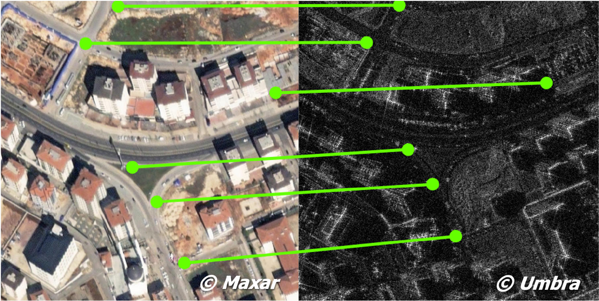

# SpaceNet 9: Cross-Modal Satellite Imagery Registration

## Challenge Overview

SpaceNet is an initiative dedicated to accelerating open-source, artificial intelligence applied research for geospatial applications. The SpaceNet 9 challenge focuses on cross-modal image registration between optical and Synthetic Aperture Radar (SAR) imagery, which is a critical preprocessing step for disaster analysis and recovery.

Swift and effective disaster response often relies on the integration of diverse remote sensing data sources. However, co-registration of optical and SAR imagery remains a major challenge due to inherent differences in their acquisition methods and data characteristics.

Participants will develop algorithms to compute pixel-wise spatial transformations between optical imagery and SAR imagery, specifically in earthquake-affected regions. These algorithms will be evaluated for their ability to align tie-points across modalities, enabling better downstream analytics such as damage assessment and change detection.

To support the competition, the challenge provides a dataset consisting of high-resolution optical imagery from the Maxar Open Data Program and SAR imagery from UMBRA. The dataset includes manually labeled tie-points to evaluate registration quality.

See the paper written by the SpaceNet team for more details (link provided in the challenge forum).

## Objective

Create algorithms that take two input images—an optical image and a SAR image—and output a two-channel transformation map. Each channel of the output image represents the shifts in the x and y directions required to align the optical image with the SAR image. See "Output File" section for more details.



*Figure 1: Example of tie-points between optical and SAR imagery. The left side shows an optical image from Maxar, and the right side shows a SAR image from Umbra. The green lines and dots represent manually identified tie-points connecting the same geographical features in both modalities. These tie-points are used to evaluate the quality of the algorithm's spatial transformation output.*

The accuracy will be evaluated using tie-points, which are manually identified matching features (e.g., road intersections) between the two images. The spatial transformation predicted by the algorithm will be applied to the tie-points in the optical image, and the alignment quality will be assessed based on the distance between the transformed points and their corresponding reference points in the SAR image.

## Dataset Details

The dataset consists of three parts:
1. **Development (training)**
2. **Public (provisional) testing** during the submission phase
3. **Final testing** after the submission phase

Each part contains several triples of files of the form (optical image, SAR image, manually labeled tie-points).

### Files Available for Download

**Development:**
- 02_optical_train_01.tif, 02_sar_train_01.tif, 02_tiepoints_train_01.csv
- 02_optical_train_02.tif, 02_sar_train_02.tif, 02_tiepoints_train_02.csv
- 03_optical_train_01.tif, 03_sar_train_01.tif, 03_tiepoints_train_01.csv

**Public testing:**
- 02_optical_publictest.tif, 02_sar_publictest.tif
- 03_optical_publictest.tif, 03_sar_publictest.tif

**Hidden evaluation files:**
- Public testing: 02_tiepoints_publictest.csv, 03_tiepoints_publictest.csv
- Final testing: 01_optical_privatetest.tif, 01_sar_privatetest.tif, 01_tiepoints_privatetest.csv

Note: Two-digit prefix in the file name corresponds to a specific area of interest (AOI) based on where the images were captured. While the development and public testing parts use two AOIs (02, 03), which are split into several subimages, the final testing part contains images from a different AOI (01). There is a single set of three files in the final testing part. All images have a width and height of less than 13000 pixels.

### Data Description

- **Optical images**: TIFF format with 3 channels (RGB)
- **SAR images**: TIFF format with a single channel
- Both contain high resolution imagery with 0.3-0.5 meter cell size
- Images contain embedded GeoTIFF metadata
- The CSV files with tie-points contain a header and four columns:
  ```
  sar_row,sar_col,optical_row,optical_col
  189,4969,430,6723
  209,408,499,794
  238,296,537,635
  ...
  ```

## Output Requirements

The algorithm must produce a TIFF file with:
- Two channels and with the same size as the input optical image
- First channel: x-shift
- Second channel: y-shift 

The shifts must be expressed in optical image pixel coordinates but computed based on transformations in geographical coordinates. The reference shifts are first determined in the geographical coordinate system and then rescaled to the optical image's pixel grid for evaluation. See the Scoring section for details on this transformation process.

## Submission Requirements

- Maximum 3 submissions per day (exception: if your submission scores 0, you may make a new submission after a delay of 1 hour)
- The /solution folder of the submission package must contain two files: solution_02_publictest.tif and solution_03_publictest.tif
- Fully automated executable software is required for verification
- Pre-trained networks are allowed if:
  - The pre-trained network dataset is unencumbered with legal restrictions that conflict with its use in the competition
  - The data source or data used to train the pre-trained network is defined in the submission description

### Preliminary Code Execution

To ensure a smooth transition to the final testing phase and provide valuable feedback, a preliminary code execution will be conducted on **May 5, 10:00 PM UTC**. Only the last submission of each participant received by this date will be evaluated. This run will test the inference code, focusing on functionality and compatibility with the evaluation environment.

## Scoring

The performance is evaluated based on the accuracy of the predicted transformation map. Let (Δx, Δy) denote the predicted pixel-wise transformation map, where Δx and Δy represent the x and y shifts, respectively, as returned by the participant's solution output.

The evaluation will use a set of tie-points P = {(ri, ci)} for i = 1, 2, ..., N manually identified in the optical image, with corresponding reference tie-points P′ = {(r′i, c′i)} in the SAR image. That is, P is formed from the 3rd and 4th column and P' from the 1st and 2nd column of the CSV file with manually labeled tie-points.

Sets P and P' are first translated into geographical coordinates using the metadata contained in the input optical/SAR image (see method `translate_tiepoints_to_geo_coords` in the scoring script):

(ri, ci) → (xi, yi),     (r′i, c′i) → (x′i, y′i).

Then the reference shifts in geographical coordinates are calculated:

Δxigeoref = x′i − xi,     Δyigeoref = y′i − yi.

These shifts are rescaled from geographical coordinates back into optical image pixel size:

Δxigeoref → Δxiref,     Δyigeoref → Δyiref.

The error for each tie-point is calculated as the Euclidean distance between the predicted and reference shifts:

Erri = sqrt((Δx(ri, ci) − Δxiref)2 + (Δy(ri, ci) − Δyiref)2),

where Δx(ri, ci) and Δy(ri, ci) are the predicted shifts at the tie-point coordinates (ri, ci).

The overall raw score for a submission is the mean error across all tie-points:

RS = (Err1 + Err2 + ... + ErrN) / N.

For leaderboard purposes, the raw score is mapped into the interval [0, 100] using the function:

Score = 100 / (1 + 0.01 ⋅ average(RS)),

where average(RS) is the average raw score across all test cases (there are two test cases in the provisional testing and one test case in the final testing). Score 100 indicates perfect performance, corresponding to exact alignment of the tie-points.

Note that only (ri, ci) coordinates present among tie-points are used for scoring. Any values of predicted shifts for coordinates which are not present among tie-points are ignored.

A scoring script is provided which you may use to test your solution locally. The same scoring script will be used for provisional and final testing.

## Baseline Solution

A baseline solution is provided as described in the paper mentioned in the Challenge Overview. The format of the baseline solution is the same as are the requirements on your submission, so if you are not familiar with Docker, you can check the baseline solution and learn by example how to dockerize your solution.

The baseline is intended as a potential starting point, offering data loaders, training of PyTorch CNN architectures for keypoint detection, and inference for performance evaluation. This baseline has not been heavily optimized for hyperparameters, and is just a possible workflow to this problem.

A trivial solution which outputs zero shifts for all points is also provided. Note that on some test cases, the trivial solution may perform better than the baseline solution. In order to win a prize, your solution must perform better than the trivial solution on the final test case.

## Available Resources

The AWS bucket contains:
- Dataset files listed in the "Dataset Details" section
- baseline-submission.zip – baseline solution
- trivial-submission.zip – solution predicting zero shifts
- perfect-solution.zip – script that creates TIFF file which receives perfect score (for understanding output format and scoring)
- scorer.zip – an offline scorer tool for local testing

## Final Testing Workflow

### Docker Container Setup
The docker container from your image will be started with the following command:
```
docker run --gpus all --ipc host -v [local_data_path]:/data:ro -v [local_writable_area_path]:/wdata -it [id]
```

### Training Script
- Signature: `train.sh [data_folder]`
- The supplied [data_folder] parameter points to a folder having all 9 training files – the same files which are available for download
- Time limit: 24 hours on a g4dn.12xlarge AWS instance
- Sample call: `./train.sh /data/train/`
- Example folder structure:
  ```
  data/
        train/
              02_optical_train_01.tif
              02_sar_train_01.tif
              02_tiepoints_train_01.csv
              02_optical_train_02.tif
              02_sar_train_02.tif
              02_tiepoints_train_02.csv
              03_optical_train_01.tif
              03_sar_train_01.tif
              03_tiepoints_train_01.csv
  ```

### Testing Script
- Signature: `test.sh [optical_image] [sar_image] [output_file]`
- Here, [optical_image] and [sar_image] are file-paths to the input images (including file names). They will be of the same format as the images in the training and public testing set, with a width and height of less than 13000 pixels. Similarly, [output_file] is the path (including file name) where the output image should be created.
- Time limit: 30 minutes on a g4dn.12xlarge AWS instance
- Sample call: `./test.sh /data/01_optical_privatetest.tif /data/01_sar_privatetest.tif /wdata/solution_01_privatetest.tif`
- Example folder structure:
  ```
  data/
         01_optical_privatetest.tif
         01_sar_privatetest.tif
  ```

### Verification Workflow
1. test.sh is run on the provisional test set to verify that the results of your latest online submission can be reproduced. This test run uses your home built models.
2. test.sh is run on the final validation dataset, again using your home built models. Your final score is the one that your system achieves in this step.
3. train.sh is run on the full training dataset to verify that your training process is reproducible. After the training process finishes, further executions of the test script must use the models generated in this step.
4. test.sh is run on the final validation dataset (or on a subset of that), using the models generated in the previous step, to verify that the results achieved in step #2 above can be reproduced.

To speed up final testing, steps 1, 3, and 4 may be skipped, but step 2 is guaranteed to be run for all submissions.

## Hardware Specifications

Your docker image will be built, test.sh and train.sh scripts will be run on a g4dn.12xlarge Linux AWS instance. 