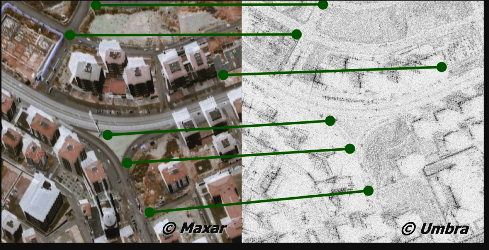
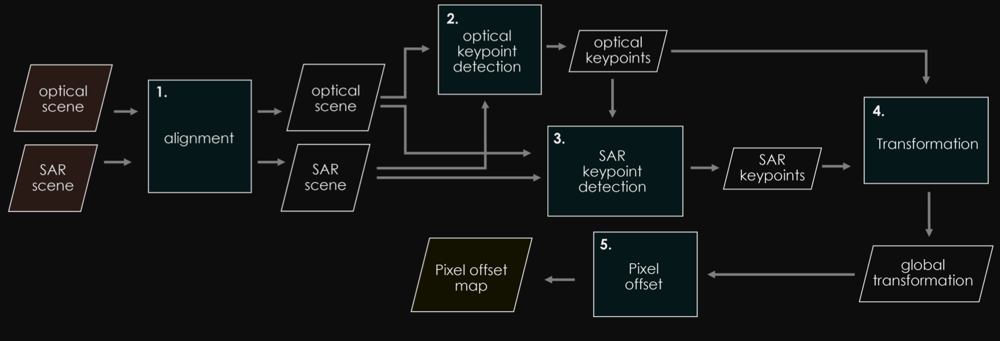
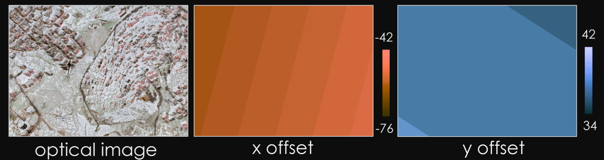

# INTRODUCING SPACENET 9 - CROSS-MODAL SATELLITE IMAGERY REGISTRATION FOR NATURAL DISASTER RESPONSES

**Authors:** Ronny Hänsch^a^, Jacob Arndt^b^, Philipe Dias^b^, Abhishek Potnis^b^, Dalton Lunga^b^, Desiree Petrie^c^, Todd M. Bacastow^d^

^a^German Aerospace Center, Germany  
^b^Geospatial Science and Human Security Division, Oak Ridge National Laboratory, United States  
^c^Maxar Intelligence, United States  
^d^GRSS, United States

## ABSTRACT

Computer vision algorithms are increasingly leveraged to accelerate geospatial analysis for disaster response and recovery. As the diversity of remote sensing imagery grows with optical, SAR, and other modalities, a perquisite for analytics is cross-modal image registration. There is a high potential to harness computer vision for this pre-processing requirement toward enabling downstream analytics such as heterogeneous change detection, automated feature extraction, and data fusion. Advancement in these areas has the potential to simplify data wrangling tasks and further accelerate disaster response timelines. The SpaceNet 9 challenge (launching in mid-2024) focuses on addressing the cross-modal image registration problem and demonstrating the utility of such modules on earthquake impacted scenarios. This paper describes the motivation for the SpaceNet 9 and provides a first overview of the dataset, the baseline algorithm, and implications for seeking cross-modal image registration in Earth observation. Code is available at https://github.com/SpaceNetChallenge/SpaceNet9.

**Index Terms:** High-resolution optical satellite imagery, SAR data, image registration, cross-modal learning, computer vision, natural disaster, disaster response, earthquake

## 1. INTRODUCTION

Founded in 2016, SpaceNet is a collaborative initiative with the goal of accelerating novel uses of open source machine learning capabilities specifically for geospatial application use cases. SpaceNet provides a repository of openly available satellite imagery with co-registered labels and access to baseline algorithms. It has hosted eight innovation challenges where the winning algorithms for each SpaceNet challenge are also open sourced. The SpaceNet team consists of contributors from Maxar, AWS, IEEE-GRSS, Oak Ridge National Laboratory, the Open Geospatial Consortium (OGC), Topcoder, and UMBRA.

Enabling first responders to react quickly to natural disasters helps mitigate the impact on people and damage to infrastructure. However, one of the impediments for analysts utilizing open datasets for disaster response is co-registration of diverse remote sensing data sources such as optical and Synthetic Aperture Radar (SAR) imagery. Co-registration is critical in order to assess the impact of a disaster with pre- and post-event imagery. Increasingly, SAR is available for post-event imagery due to a wider commercial availability, as well as the benefit of being able to image through cloud cover and during nighttime. However, cross-modal registration between optical and SAR imagery is very challenging due to the inherently different imaging geometries.

SpaceNet 9 (SN9) is designed to accelerate the ability to leverage cross-modal image registration. We believe computer vision algorithms on remote sensing data are key to accelerating disaster response efforts, and that improved automated pre-processing for cross-modal imagery is essential for such downstream analysis. This challenge will build upon previous SpaceNet challenges that focused on identification of infrastructure and use of SAR imagery [1]. As an extension, the challenge will enable the understanding of natural disaster impacts by considering building damage assessment [2]. Although we illustrate cross-modal registration for earthquake impacted infrastructure, the implications of the study outcomes extend to other weather related disasters including basin-scale floods due to heavy rainfall and snowmelt, tornadoes, and hurricane storm surges impacts on coastal areas.

## 2. DATASET AND CHALLENGE

The SpaceNet 9 dataset consists of several areas of interest (AOIs) with optical imagery provided through the Maxar Open Data Program and SAR imagery from UMBRA. Similar to SpaceNet 8 [3], the imagery used in this challenge are actual disaster response datasets that were released at the time of the natural disasters by their providers to support humanitarian relief efforts. Challenge participants will be asked to algorithmically establish a pixel-wise transformation across the optical and SAR images. In addition to the imagery, tie-points are manually established identifying matchable key features such as road intersections (see Figure 1) allowing evaluation of cross-modal image alignment quality.

Similar to previous SpaceNet challenges, one set of AOIs will be provided as a training dataset, a second AOI set will be used for public testing with the labels held back, and a third AOI set will be used as a private test dataset for which the top algorithms will be run for the final scoring. The training dataset consists of Maxar optical images, UMBRA SAR images, and a CSV file with the coordinates of tie-points across these images. Each AOI has approximately 500 optical to SAR tie-points.

A baseline algorithm will be provided that automates the registration of the images. The objective of SN9 is to substantially improve upon the accuracy of this baseline or find other novel approaches to perform this task.

Accurate coregistration of SAR and optical imagery is a difficult task. The geometric and radiometric properties of these data are vastly different due to their underlying acquisition concepts, making their joint interpretation and matching difficult. SAR data measure physical properties of the scene and are collected based on range measurements while optical imagery measures chemical properties and are collected in a perspective projection [4, 5, 6]. SAR data are collected with a side-looking geometry resulting in geometric distortions such as layover, foreshortening, and radar shadow that do not appear in optical imagery. In addition, SAR includes speckle that further contributes to the visual differences between the two modalities. Figure 1 provides a visual illustration of the differences in these modalities for an urban area.

Several existing datasets pairing SAR and optical images have been developed in recent years. The SEN1-2 dataset [6], for example, consists of approximately 280,000 matching image pairs from across the globe collected by Sentinel 1 and Sentinel 2 and has been used in image patch matching studies. The SARptical dataset [7] consists of 10,000 pairs of high-resolution SAR and high resolution optical imagery focused on dense urban areas. The QXS-SAROPT dataset [8] consists of 20,000 image patch pairs of co-registered high-resolution (1m GSD) SAR and optical images acquired by GaoFen-3 and optical satellites used for Google Earth. The SOPatch [9] dataset, curated to focus on sensor robustness and land-cover variations, consists of 650,000 matching SAR-optical image pairs, derived from WHU-SEN-City [10], OSdataset [11], and SEN1-2 dataset [6].

Classical computer vision methods, such as SIFT or other handcrafted features, were found to be inadequate for accurate SAR to optical image matching [12]. As a result, modifications to these algorithms as well as deep learning have been proposed to help improve cross-modality image registration and matching. Several existing works use (pseudo-)siamese architectures [4, 5, 13] to discern whether two input patches correspond to one another.

Most existing benchmarks and methods address cross-modal image matching, i.e. the classification whether two given image patches show the same scene, i.e. are centered around the same spatial coordinate. This, however, assumes a preceding step of extracting such candidates. SN9 is closer to a more realistic scenario where only two larger image regions are given that are coarsely aligned through geocoding. The goal is to compute a fine alignment between both images, i.e. the optical and SAR data. Participants will be asked to provide the corresponding spatial transformation maps that will be evaluated by transforming the tie-point coordinates in one image into the other image and measuring the spatial distance of the transformed points to the coordinates of the reference points.

## 3. BASELINE

The proposed baseline consists of scene alignment, training dataset tiling and keypoint heatmap label generation, and keypoint detection network training. To use the baseline at test-time, we develop a workflow consisting of scene alignment, optical and SAR keypoint detection using the trained networks, and transformation estimation from the detected keypoints. Finally, we use the transformation and dimensions of the original optical scene to create a pixel offset image that describes for each pixel in the optical scene, the shift in the x- and y-direction that is required for determining the corresponding pixel in the SAR scene. The pixel offset map is the solution used for evaluation.

**Scene alignment:** We resample and zero-pad the SAR and optical scenes so that they have the same spatial extent and spatial resolution. To match spatial resolutions, we resample the scene with higher spatial resolution so that its pixel size matches the spatial resolution of the scene with lower spatial resolution. Following this resampling, we zero pad the scenes to give them the same spatial extent.

### 3.1. Training

**Tiles preparation for training keypoint detectors:** We create two tiled datasets from the training set of AOIs to train the keypoint detection networks. One tiled dataset is used to train the optical keypoint detection network while the other is used to train the SAR keypoint detection network. The SAR keypoint detection dataset consists of optical-SAR pairs of image crops and SAR keypoint heatmaps as labels. Similar to [12], we crop both the optical scene and SAR scene centered on the optical keypoint location and create a single-channel heatmap label with a 2D Gaussian kernel with standard deviation of 13 pixels, centered on the location of corresponding SAR keypoint. For the optical keypoint detection dataset, we follow an analogous process where we crop the SAR and optical scene centered on the SAR keypoint instead, creating the heatmap label with 2D Gaussian kernel centered on the location of the corresponding optical keypoint. In both datasets, we use a tile size of 256 × 256 pixels. Figure 2 depicts a sample example in the SAR keypoint detection dataset.

**Keypoint detection:** We develop two keypoint detection networks that are separately trained. One network is trained to detect SAR keypoints and the other to detect optical keypoints. Both keypoint detection networks follow a U-Net style architecture, configured for pixel-wise regression and trained to approximate the keypoint heatmaps labels. The outputs from intermediate blocks of each encoder are concatenated and passed through a single decoder that produces a single-channel feature map. We apply a sigmoid function to this final feature map and use these as input into an MSE loss weighted at the pixel level to account for imbalance in the number of non-zero valued pixels in the reference keypoint heatmap. Similar to the loss in [12], this emphasizes the loss at the keypoint location to be given equal importance as the loss at zero-valued locations in heatmap.

### 3.2. Inference

For inference, the goal is to compute a fine alignment between an optical scene and a SAR scene. The baseline inference workflow relies on the trained optical keypoint and SAR keypoint detection networks to find corresponding keypoints between images. The detected keypoints are then used to estimate a geometric transformation between the images. The end-to-end workflow is shown in Figure 3.

**Keypoint detection:** In contrast to the training phase where labeled tiepoints are available, in the inference phase we do not have locations of optical keypoints or SAR keypoints to guide where in the large optical scene the detection networks should be deployed to. In this baseline configuration, we opt for predicting optical keypoints with the optical keypoint detector across the entire optical scene in a uniform grid every 100 meters. Then, the remaining of the workflow in Figure 3 applies, with the detected optical keypoints referenced for cropping, and the SAR keypoint detector deployed to find corresponding SAR keypoints.

**Transformation estimation:** Given the detected optical keypoints and SAR keypoints, we estimate a geometric transformation to warp the optical image to the SAR image. In this baseline, we pair affine transformation estimation with RANSAC to estimate the transformation between the detected optical and SAR keypoint sets. Finally, we use the estimated transformation to create a pixel-offset map that describes the x- and y-direction shift for each pixel in the optical image that is needed to co-register it with the corresponding SAR pixel. An example of this pixel offset map is shown in Figure 4.

## 4. EXPERIMENTS

The following experiments demonstrate usage of this dataset and measure the performance of the baseline approach. With these experiments we show that: 1) the provided labeled dataset (tiepoints) is sufficient for estimating a tranformation that improves the coregistration of the input SAR and optical image scenes, 2) it is possible to learn keypoint detectors from the labeled tiepoints to automate keypoint detection within patches, and 3) an automated image registration workflow using the aforementioned baseline configuration does improve coregistration of SpaceNet 9's SAR and optical scenes, but leaves significant room for improvement for participants of the challenge to outperform such a baseline.

For evaluating coregistration, we use the average distance between transformed optical keypoints and the corresponding reference SAR tiepoints.

**Transformation on annotated tiepoints:** Before any transformation, the average distance between annotated optical and SAR tiepoints for the two AOIs are between 30 and 35 meters (Table 1). Applying a global affine transformation using the reference tiepoints reduces the mean average distance by 8 to 17 meters, depending on the AOI (Table 2). Using RANSAC for transformation estimation from the same reference tiepoints showed marginal improvement of about 1 meter relative to not using RANSAC. This represents an "upper bound" of performance that can be obtained by a single global affine transformation for the provided datasets – i.e., assuming keypoint detectors could perfectly replicate locations of labeled tiepoints.

**Table 1. Reference tiepoints without transformation.**

| AOI | Mean Distance (m) | Mean Distance (pixels) |
|-----|-------------------|------------------------|
| AOI-1 | 30.22 | 84.54 |
| AOI-2 | 34.96 | 85.46 |

**Table 2. Evaluation of transformations on reference tiepoints.**

| AOI | Transformation | Mean Distance (meters) | Mean Distance (pixels) |
|-----|---------------|------------------------|------------------------|
| AOI-1 | Affine without RANSAC | 14.24 | 39.84 |
|       | Affine with RANSAC | 13.14 | 37.77 |
| AOI-2 | Affine without RANSAC | 27.88 | 68.14 |
|       | Affine with RANSAC | 26.31 | 64.31 |

**Learning keypoint detection:** We created a tiled dataset from the annotated tiepoints and randomly split the dataset into 80% training and 20% validation. We trained separate SAR keypoint detection and optical keypoint detection networks, both using the same training hyperparameters. We trained for 100 epochs using the Adam optimizer with initial learning rate of 1e-4 and used a step learning rate schedule to attenuate the learning rate by a factor of 1e-2 after 30 epochs. Models were trained on a single NVIDIA V100 GPU (32GB).

Figure 5 illustrates visual examples of predicted SAR keypoints on two samples in the validation dataset using the trained SAR keypoint detection network. A final keypoint from the predicted heatmap was determined by computing the pixel coordinates of the maximum value in the heatmap (i.e. argmax). In the future, other methods for peak finding may be valuable such as the method used in [12].

**Inference:** We tested the inference workflow outlined in Figure 3 for both AOIs using the trained keypoint detectors. Results are shown in Table 3. The proposed baseline improved coregistration of SAR and optical images in one AOI while it failed in the second AOI.

**Table 3. Coregistration results after using RANSAC to estimate an affine transformation between detected keypoint sets.**

| AOI | Optical Keypoints | Inliers | Mean Distance (meters) | Mean Distance (pixels) |
|-----|-------------------|---------|------------------------|------------------------|
| AOI-1 | 840 | 59 | 20.99 | 58.72 |
| AOI-2 | 930 | 81 | 40.68 | 99.46 |

## 5. CONCLUSION

SN9 will advance the understanding and implementation of techniques to accelerate cross-modal image registration for optical and SAR imagery. We believe these algorithms can provide substantial benefit in accelerating workflows for the disaster response community that is increasingly faced with leveraging diverse remote sensing data to perform time-sensitive analysis following natural disasters. Once the results of SN9 are available, future papers will describe the winning algorithms and assess their approaches.

## 6. ACKNOWLEDGEMENTS

We acknowledge that this manuscript has been authored by UT-Battelle, LLC under Contract No. DE-AC05-00OR22725 with the U.S. Department of Energy. The United States Government retains and the publisher, by accepting the article for publication, acknowledges that the United States Government retains a non-exclusive, paid-up, irrevocable, world-wide license to publish or reproduce the published form of this manuscript, or allow others to do so, for United States Government purposes. DOE will provide public access to these results of federally sponsored research in accordance with the DOE Public Access Plan (http://energy.gov/downloads/doe-public-access-plan).

## 7. REFERENCES

[1] Jacob Shermeyer, Daniel Hogan, Jason Brown, Adam Van Etten, Nicholas Weir, Fabio Pacifici, Ronny Hänsch, Alexei Bastidas, Scott Soenen, Todd Bacastow, and Ryan Lewis, "SpaceNet 6: Multi-Sensor All Weather Mapping Dataset," in 2020 IEEE/CVF Conference on Computer Vision and Pattern Recognition Workshops (CVPRW), 2020, pp. 768–777.

[2] Ritwik Gupta, Richard Hosfelt, Sandra Sajeev, Nirav Patel, Bryce Goodman, Jigar Doshi, Eric Heim, Howie Choset, and Matthew Gaston, "xBD: A Dataset for Assessing Building Damage from Satellite Imagery," 2019.

[3] Ronny Hänsch, Jacob Arndt, Matthew Gibb, Arnold Boedihardjo, Tyler Pedelose, and Todd M. Bacastow, "The SpaceNet 8 Challenge - From Foundation Mapping to Flood Detection," in IGARSS 2022 - 2022 IEEE International Geoscience and Remote Sensing Symposium, 2022, pp. 5073–5076.

[4] Lloyd H. Hughes, Michael Schmitt, Lichao Mou, Yuanyuan Wang, and Xiao Xiang Zhu, "Identifying Corresponding Patches in SAR and Optical Images With a Pseudo-Siamese CNN," IEEE Geoscience and Remote Sensing Letters, vol. 15, no. 5, pp. 784–788, 2018.

[5] Nina Merkle, Wenjie Luo, Stefan Auer, Rupert Müller, and Raquel Urtasun, "Exploiting Deep Matching and SAR Data for the Geo-Localization Accuracy Improvement of Optical Satellite Images," Remote Sensing, vol. 9, no. 6, 2017.

[6] M. Schmitt, L. H. Hughes, and X. X. Zhu, "The SEN1-2 dataset for deep learning in SAR-optical data fusion," ISPRS Annals of the Photogrammetry, Remote Sensing and Spatial Information Sciences, vol. IV-1, pp. 141–146, 2018.

[7] Yuanyuan Wang and Xiao Xiang Zhu, "The SARptical Dataset for Joint Analysis of SAR and Optical Image in Dense Urban Area," in IGARSS 2018-2018 IEEE International Geoscience and Remote Sensing Symposium. IEEE, 2018, pp. 6840–6843.

[8] Meiyu Huang, Yao Xu, Lixin Qian, Weili Shi, Yaqin Zhang, Wei Bao, Nan Wang, Xuejiao Liu, and Xueshuang Xiang, "The QXS-SAROPT dataset for deep learning in SAR-optical data fusion," arXiv preprint arXiv:2103.08259, 2021.

[9] Wangyi Xu, Xinhui Yuan, Qingwu Hu, and Jiayuan Li, "SAR-optical feature matching: A large-scale patch dataset and a deep local descriptor," International Journal of Applied Earth Observation and Geoinformation, vol. 122, pp. 103433, 2023.

[10] Lei Wang, Xin Xu, Yue Yu, Rui Yang, Rong Gui, Zhaozhuo Xu, and Fangling Pu, "SAR-to-optical image translation using supervised cycle-consistent adversarial networks," Ieee Access, vol. 7, pp. 129136–129149, 2019.

[11] Yuming Xiang, Rongshu Tao, Feng Wang, Hongjian You, and Bing Han, "Automatic registration of optical and sar images via improved phase congruency model," IEEE Journal of Selected Topics in Applied Earth Observations and Remote Sensing, vol. 13, pp. 5847–5861, 2020.

[12] Lloyd Haydn Hughes, Diego Marcos, Sylvain Lobry, Devis Tuia, and Michael Schmitt, "A deep learning framework for matching of SAR and optical imagery," ISPRS Journal of Photogrammetry and Remote Sensing, vol. 169, pp. 166–179, 2020.

[13] Han Zhang, Weiping Ni, Weidong Yan, Deliang Xiang, Junzheng Wu, Xiaoliang Yang, and Hui Bian, "Registration of Multimodal Remote Sensing Image Based on Deep Fully Convolutional Neural Network," IEEE Journal of Selected Topics in Applied Earth Observations and Remote Sensing, vol. 12, no. 8, pp. 3028–3042, 2019.